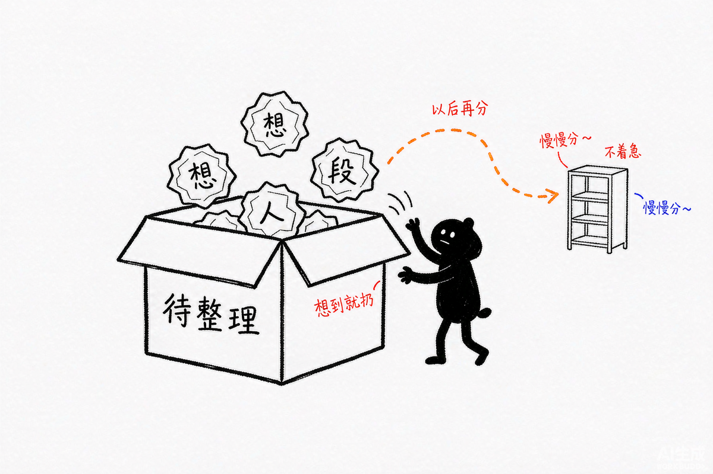
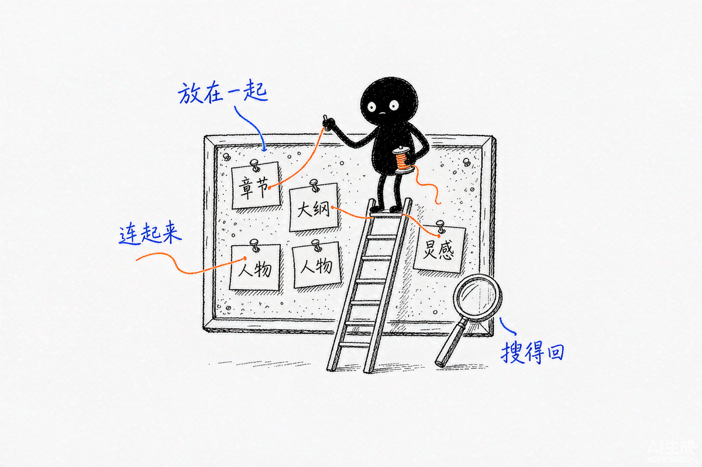
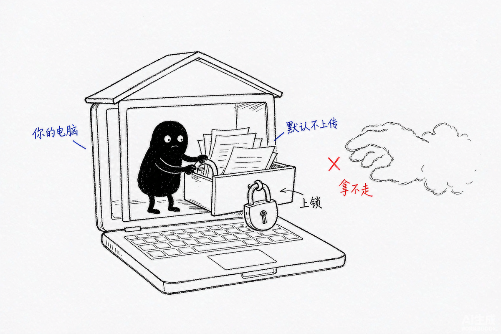

# 从第一段开始 · 新手写作上手指南

如果你刚开始写小说，脑子里有一些人物、画面或情节，却还没想好怎么安排，可以先把文字放进来。你不必先做完整大纲，也不必先给每份资料分类。先留下内容，之后再慢慢找、慢慢改。

界面会把很多信息留作选填。作品名、章节名、人物资料和故事方向都可以先空着；分类没想好时选“待整理”。这套做法希望让刚开始写作、容易被复杂步骤卡住的作者更容易开始，也照顾到部分 ADHD 作者可能遇到的启动和整理负担。每个人的体验不同；目前还没有 ADHD 作者参与的正式可用性测试。

## 第一次打开

1. 在[最新版下载页](https://github.com/fv6zp84ngy-hue/novel-workspace/releases/latest)下载 `novel-workspace-latest.zip`，解压到电脑上一个你容易找到的位置。不要在压缩包里直接运行。
2. 电脑需要预装 Python 3.10 或更新版本。macOS 双击 `Start.command`；Windows 双击 `Start.bat`；Linux 在这个文件夹打开终端并运行 `sh Start.sh`。启动窗口先留着，浏览器会打开写作页面。
3. 首次打开时，设置资料库密码并记下来。这个密码用于保护你的作品；忘记后无法找回。完成这一步，就可以开始写作，不需要注册账号或配置 AI。

如果启动遇到问题，请看[常见启动问题](开始使用.txt)。不要双击 `index.html`，也不要关闭启动窗口后继续使用。

## 写下第一个故事

在开始页点“新建故事”，再按当前页面提供的选项选择新故事或已有稿件。

- 如果还没有现成稿件，可以用一句话说说你想写什么，挑一个创作模板，或者直接从空白作品开始。
- 如果已经在别处写了一些内容，可以粘贴稿件，或之后再导入 TXT、Markdown 文件。
- 作品名、创作方向和故事想法都能先留空。先创建一个位置，等有空再补也可以。

创建后，打开章节，在正文里写下第一段。写到一小段就可以停下来看看页面上的保存状态；显示已保存后，你的内容已经写进本机资料库。模板生成的内容可以直接改写，也可以删除后从自己的文字开始。

## 把散落的资料放进来

打开“资料”，你可以粘贴文字，也可以导入 TXT 或 Markdown 文件。先放进去就好，标题、关键词、分类和关联章节之后都能补。默认的“待整理”会帮你先接住暂时不知道放哪的内容。

需要找回资料时，使用“找资料”搜索人名或正文片段。找到之后可以打开原文，也可以把资料关联到相关章节。分类只是帮你以后更快找到线索，不是对写作好坏的评价；一份资料选一个主要分类就够了。你可以从人物、情节冲突、场景设定、线索时间、灵感碎片和外部参考里挑一个，也可以保持“待整理”。

## 记住下一件小事

如果写到一半想到“下次要补一个人物动机”或“检查这条线索的时间”，打开“任务”记下一件具体的小事。关联章节是选填的；做完后勾选即可。先记一件就够了，不需要把所有待办一次列完。

## 保护稿件

作品默认保存在当前浏览器的本机加密资料库里，不会因为使用基础写作功能自动上传。请等页面显示已保存，再关闭页面或停止服务。

建议定期打开“备份与恢复”，导出完整加密备份，并确认文件已经下载到电脑。把备份放在项目文件夹之外；迁移到另一台电脑或浏览器时，再用备份恢复为新副本。恢复不是实时同步。换浏览器、网址或端口，也会打开另一个本地资料库。

误改时可以用历史版本恢复，误删时可以到回收站找回。保存失败时先保留页面和启动窗口，不要清理浏览器网站数据。TXT 导出是未加密的纯文字，分享前请确认里面没有不想公开的内容。

## AI 和网盘是可选项

你可以只用本地写作、资料整理、搜索和备份，不连接 AI 或网盘。之后如果想用智能助手，需要在“安全与服务”里填写自己的模型服务信息；模型调用费用由你自己的服务商账户承担。WebDAV 网盘和章节协作也需要你自己提供网盘服务。使用方法和限制见[技术与项目说明](README.TECHNICAL.md)。

## 现在只想做一件事？

打开工作台，创建一个空白故事，写下一段文字。分类、人物卡、大纲和任务都可以留到下一次。

[返回项目首页](README.md) · [详细功能和验证说明](README.TECHNICAL.md) · [完整第一次使用手册](docs/USER_GUIDE.md)
