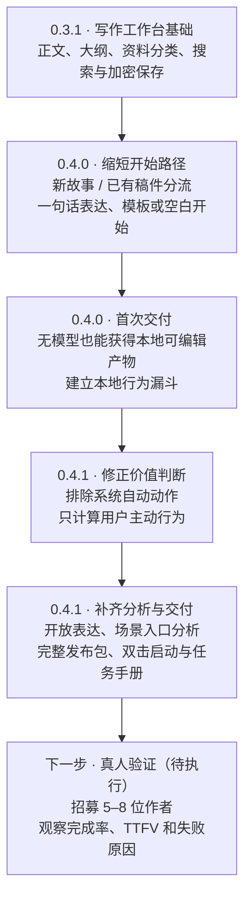
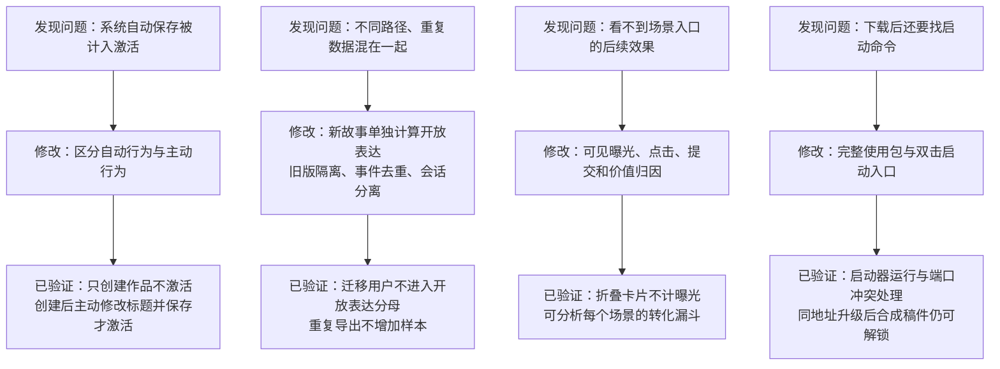
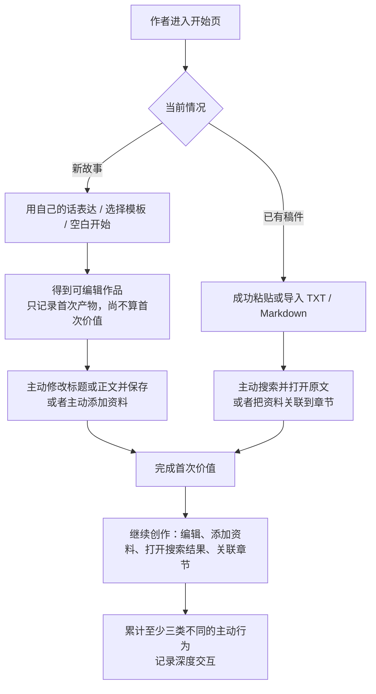

# 未完待续 · Novel Workspace

为刚开始写小说的作者，把正文、大纲、人物和散落资料放进一个能找回、能引用、能继续写的空间。

[English](README.en.md) · [使用指南](docs/USER_GUIDE.md) · [需求完成情况](docs/REQUIREMENTS.md) · [MIT](LICENSE)

## 下载与使用

**[下载最新版完整使用包](https://github.com/fv6zp84ngy-hue/novel-workspace/releases/latest/download/novel-workspace-latest.zip)** · [查看当前 Release](https://github.com/fv6zp84ngy-hue/novel-workspace/releases/latest)

下载文件名为 `novel-workspace-latest.zip`。这是包含全部程序与预构建模块的使用包；每次发布新版，Latest 下载入口提供当前版本。历史版本保留在各自 Release 中，便于追溯。发布状态与维护者操作见 [发布说明](docs/PUBLISHING.md)。

解压后，预装 **Python 3.10+**，macOS 双击 `Start.command`、Windows 双击 `Start.bat`，按提示启动，浏览器自动打开；无需 Node、npm 或构建。完整说明见 [开始使用](开始使用.txt)。当前是个人试用版本；Windows 启动入口已提供，Windows 真机仍待验证。

## 迭代路线：从能写作，到能验证首次价值

目标是让刚开始写小说的作者更快获得可以继续编辑的作品，并能找回散落资料。每轮迭代都围绕“更容易开始”和“如何判断确实帮到了作者”展开。



这里的“无模型产物”来自本地模板并保留作者原话，不是一次真实 AI 生成；模型调用仍需作者主动配置并发起。

## 0.4.1 具体改了什么



首次价值的关键差别如下。自动生成作品和创作起点属于“首次产物”，用户在此之后做出主动操作，才可能完成“首次价值”。



深度交互在状态机中独立按主动行为类型统计；图中的顺序表示典型使用过程。自动生成、失败操作和重复同类操作都不能凑够三类。

## 更新效果：已验证与待验证

| 目标 | 当前证据 | 结论边界 |
| --- | --- | --- |
| 更准确识别首次价值 | 两组浏览器回归：自动创建不激活，只改标题并保存会激活 | 证明判定修复，尚未证明真人转化提升 |
| 更可信地统计深度交互 | 自动、失败、未知来源事件排除；三类主动操作触发一次 | 证明行为统计正确，尚未证明作者更愿意持续使用 |
| 看懂入口表现 | 新故事开放表达分母、场景归因、旧版隔离、重复导出去重测试通过 | 可以开展分析，当前没有真人场景转化结果 |
| 降低运行门槛 | 完整包含预构建模块；提供启动器，无需 npm 或构建 | 仍需 Python 3.10+；Windows 真机待验 |
| 保留升级前内容 | macOS 隔离 Chromium 实测同地址升级后合成标题、正文可解锁读取 | 不代表所有设备和极端故障均已覆盖 |

**验证总览：26 项 Node + 26 项 Python 自动化测试通过；Control / Treatment 浏览器链路和合成覆盖升级通过；95 个公开文件通过白名单与敏感模式检查。** 具体环境和证据见 [测试报告](docs/TEST_REPORT.md)。

**真人验证仍为 0 / 至少 5 人。** 任务手册、访谈问题、记录表与模拟资料已准备，见 [真人验证流程](docs/REAL_USER_VALIDATION.md)。目前可以说“完成链路设计、修正测量口径并建立验证流程”，不能说“已验证 TTFV 缩短”或“本原型首次价值提升 12%”。修正口径后统计完成率可能下降，因为移除了原先的高估。

## 现在能做什么

- 可用一句话或八类本地模板建立作品，也可先建空白作品、稍后迁入稿件；无需模型账户也能写作。
- 多作品、章节、大纲、任务、TXT / Markdown 导入、分类和原文查找。
- 本机加密保存、历史恢复、冲突副本、加密备份与副本恢复。
- 可选：连接自己的模型账户，按内容分类、建立增量向量索引、语义联想、带出处问答及草稿生成。
- 可选：把加密快照保存到自己的 WebDAV 网盘；同一章节可进入协作编辑，数秒轮询并自动合并正文。
- 历史容量预览，下载备份后清理旧版本；清理可重建的向量缓存。
- 新增 Control / Treatment 首次使用路径、本地匿名漏斗事件、首次价值计算与离线汇总；不连接第三方分析服务。

版本 0.4.1。资料名称、创作方向、故事想法和分类均可先留空；“待整理”会接住尚未想清楚的内容。分类补充人物、情节冲突、场景设定、线索时间等写作检索入口，且能随时改动。字段说明见 [必填与选填指南](docs/FIELD_GUIDE.md)。首次入口可用 `?onboarding=control` 固定旧版流程，或 `?onboarding=treatment` 测试“新故事 / 已有内容很散”两条路径。Treatment 的自然语言输入会作为“创作起点”保存在本机，即使没配置模型也会生成可编辑作品；AI 不会在创建时自动接收输入。

本地漏斗检查页：[debug/funnel.html](debug/funnel.html)。事件保存在独立 IndexedDB，不采集正文、Prompt 原文、名称、搜索词、文件路径、模型响应或凭据。测试者可手动导出 JSON；将多份导出放进一个目录后运行 `python3 scripts/analyze_funnel.py ./导出目录`，离线查看各步骤完成率、中位 TTFA 与 TTFV。0.4.1 排除开始页自动行为：主动保存标题/正文或资料才可能完成首次价值，三类主动核心行为才计深度交互；另输出新故事开放表达渗透率与场景曝光、点击、提交、价值转化。旧版事件隔离，重复导出按事件 ID 去重。当前没有真实用户埋点数据或显著性结论。详见 [测量口径](docs/MEASUREMENT.md) 和 [真人测试手册与素材](docs/REAL_USER_VALIDATION.md)；真人测试目前为 0 / 至少 5 人。

章节正文协作使用自己的 WebDAV 文件夹，打开期间约每 3 秒检查并自动合并文字；实际延迟取决于网盘和网络。整库加密快照仍保留手动备份。合成服务与双窗口已验收，真实网盘、跨实体设备和付费模型尚待验证。既往业务数据与本项目原型结果分开记录，不代表本项目测试结果。

## 三步开始

需要 Python 3.10+；发布包已包含固定版本的 Yjs 浏览器文件，运行时无须安装 npm 包：

```sh
python3 scripts/serve.py
```

1. 打开 [本地工作台](http://127.0.0.1:8765/)。端口占用可用 `--port 8771`；固定使用同一地址，换端口不会自动迁移数据。
2. 设置至少 12 个字符的资料库密码，妥善保管。忘记密码无法恢复。
3. 创建故事或导入资料。需要模型时，打开“安全与服务”填写服务地址、自己的 API Key、对话与向量模型 ID，然后使用“智能助手”。

API 费用由用户自己的服务商账户承担；网盘存储另按用户的套餐收费。本工具不代收费用，没有公共付费代理，也不提供免费 token。密钥只保留在本机服务内存；客户端配置不写入备份。详见 [隐私](PRIVACY.md)。

## 稿件保护

IndexedDB 内容和完整备份使用 AES-256-GCM 加密。默认不上传；只有点击发送/同步才联网。TXT 导出是明文。备份密码通常就是导出时的资料库密码。

清理浏览器网站数据、忘记密码或丢失设备仍会造成损失。请定期导出，并在测试区验证恢复。加密不能防止解锁后的恶意扩展、设备控制或旧明文磁盘残留。40 MiB 解密后快照上限适合小型个人库，尚未验证长篇大型库的持续性能。

## 开发与验收

另需 Node.js 22+：

```sh
python3 -B scripts/check.py
python3 -B scripts/build_release.py
```

- [基础数据验收](tests/browser.html) / [加密与故障验收](tests/vault.html)：随机测试库，不访问作者库。
- [窄屏布局](tests/responsive.html) / [性能抽样](tests/performance.html)：合成验证，不代替真实设备。
- [PRD](docs/PRD.md) / [Spec](docs/SPEC.md) / [设计](docs/DESIGN.md) / [分步开发](docs/DEVELOPMENT.md)
- [字段与分类设计](docs/FIELD_GUIDE.md) / [需求核对](docs/REQUIREMENTS.md)
- [项目机器可读规格](docs/PROJECT.json) / [本地漏斗检查页](debug/funnel.html)
- [测试记录](docs/TEST_REPORT.md) / [设备与真实服务验收](docs/ACCEPTANCE.md) / [风险](docs/RISK_REVIEW.md)
- [发布步骤](docs/PUBLISHING.md) / [安全](SECURITY.md) / [贡献](CONTRIBUTING.md)

GitHub Pages 可提供本地写作界面；模型和 WebDAV 必须由本机 Python 启动器提供，不能把该网关当成公网多用户服务。

## 两端协作同一章

先在一台设备导出完整加密备份，在另一台设备恢复为作品副本；两端因此保留同一章节的协作编号。打开该章节，点“协作编辑”，填同一个 WebDAV 文件夹、网盘应用密码和协作解密口令。两个设备同时保持章节协作窗口打开，正文先保存本机，再发送加密更新；遇到远端抢先写入会重新读取并合并。关闭窗口会停止轮询，重新打开可继续处理本机待同步修改。

同一句话上的不同改动可能出现语义不通顺，请查看历史版本。当前版本只合并章节正文；章节名、任务、资料分类和删除仍由各端自行管理。详见 [协作设计与边界](docs/LIVE_MERGE_DESIGN.md)。
