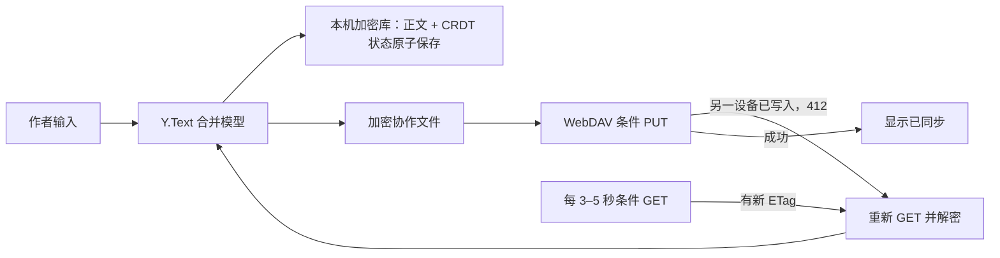

# 多设备章节合并：实现与验证边界 · 0.3.0

## 先定义“实时”

原有用户自带 WebDAV 只支持手动上传和恢复整库加密快照。0.3.0 新增章节级协作。WebDAV 没有向浏览器主动推送更新的连接，因此当前产品做到**打开协作章节期间，约 3–5 秒轮询并自动合并文字**，实际延迟取决于网络和网盘服务；不承诺亚秒级同屏。真正的低延迟同屏编辑需要运行 WebSocket 协作服务。两条路线共用同一套正文合并模型。

WebDAV 的 ETag 只能阻止旧版本覆盖新版本，无法自行合并两份正文。协作正文使用成熟 CRDT（Yjs 的 `Y.Text`）；其更新可乱序、重复应用后收敛。不能把整章字符串按“最后上传者获胜”写回网盘，也不能把当前 `restoreBackup()` 的“创建新作品副本”循环当作合并。

## 最小产品范围

当前只让**同一章节正文**进入协作模式。作品名、章节顺序、资料分类、任务、删除和恢复仍按现有本地流程处理；需要共享时使用现有加密快照。章节的“协作编辑”是独立入口，普通编辑器和协作编辑器不能同时编辑同一章。默认不自动联网，作者主动连接自己的 WebDAV 后，界面持续显示“本机已保存 / 正在同步 / 多端已同步 / 同步暂停”。关闭协作窗口即停止轮询。

首次进入需要绑定稳定 `syncId`，该 ID 在恢复为本地副本时保留，浏览器内部 `document.id` 仍可重映射。远端每章一个文件，例如 `<作者提供的专用目录>/<syncId>.live.json`；与现有 `novel.json` 整库快照分开。没有相同 `syncId` 的作品不能误连同一远端章节。第二台设备先用现有加密备份带入同一作品，或经未来的“加入协作作品”流程取得映射。

## 数据路径

每个协作文件只存版本、`syncId` 和 Base64 编码的 CRDT 更新，整体用当前 WebCrypto AES-GCM 加密；目前没有对更新做额外压缩。WebDAV 登录信息与协作解密口令只留在本次会话内存。远端仍可看到文件名、大小和修改时间，因此文件名优先使用随机 ID。

本地必须把可见正文与 CRDT 状态放在**同一次加密事务**；不能先改正文、后存 CRDT，也不能直接使用未加密的通用 `y-indexeddb` 数据库。保留现有版本历史，在合并前后产生可比较的快照。WebDAV `GET` 带 `If-None-Match`，未变化时接受 304；`PUT` 首次带 `If-None-Match: *`，后续带强 `If-Match`。遇 412 时重新下载、应用远端更新、重新加密、有限次数重试；一直失败时保留本机编辑并停止自动重试风暴。

编辑区用 textarea 时，将输入差异变为 `Y.Text` 操作；远端更新显示时尽量保持光标。中文输入法组词期间不重写 textarea，结束组合后一次应用本地输入，再更新远端。后台标签页计时器可能被限速，恢复前台时立即同步一次。断网后本地仍可写，状态显示“仅本机保存”。

## 安全与故障边界

- 远端口令错误、密文篡改或协作文件 `syncId` 不匹配：停止协作，不改写本地正文。
- 本地正文与远端内容不同，但本地没有可验证的 CRDT 基线（例如从旧备份恢复后又独立修改）：先留本地副本，再接入远端；不能猜测共同祖先。
- 服务不提供可靠强 ETag 或不执行条件写入：禁用自动覆盖，退回现有手动快照流程。
- 合并意味着操作收敛，不保证两个人写出的句子在语义上通顺。保留历史、变更提示和撤销入口。
- 不自动合并章节删除、章节重命名、任务或资料。这些字段须另设计稳定 ID、墓碑、权限和冲突 UI。
- CRDT 历史会增长；设置每章容量上限与暂停状态。压缩/重置必须先确认所有设备的离线更新已纳入，不能随意删除旧操作。
- 同一浏览器多标签使用同一加密库；章节版本冲突会阻止旧 revision 回写，但当前没有跨标签共享一个活跃协作会话。多标签同时编辑同章仍需谨慎，以保留副本处理冲突。

## 分步开发与验收门槛

1. **本地双窗口合并**：已引入固定版本 Yjs 及许可证，建立章节 `syncId` 和原子保存；合成双窗口的并发插入收敛已验证。真实中文输入法与实体设备仍待验。
2. **WebDAV 条件传输**：已增加独立协作文件、条件 GET/PUT、412 后重新合并、弱 ETag 拒绝、密文格式/大小校验；已在进程内合成网盘和双窗口验证。真实服务支持情况待验。
3. **恢复和迁移**：已实现老文档首次基线、备份恢复保留协作编号、无共同基线保留副本；断网、标签页休眠、进程重启和真实网盘暂时失败仍需补实测。
4. **真实服务与体验**：至少两台真实设备同章并写，记录编辑延迟、字符丢失、错误恢复和网盘请求量；验证目标 WebDAV 服务确实支持强 ETag 与条件 PUT。没有这些证据不标记“实时合并已完成”。

若选 WebSocket 路线，第 1 步相同；第 2 步改为独立协作服务负责传递加密 CRDT 更新、身份和房间权限，WebDAV 只保留定期加密备份。这需要部署、运行成本及权限管理，亚秒级体验才有明确基础。

技术依据：[Yjs 更新 API](https://docs.yjs.dev/api/document-updates)、[WebDAV RFC 4918 的 ETag 与丢失更新说明](https://www.rfc-editor.org/rfc/rfc4918.html#section-8.6)、[HTTP ETag 条件请求](https://developer.mozilla.org/en-US/docs/Web/HTTP/Reference/Headers/ETag)。
