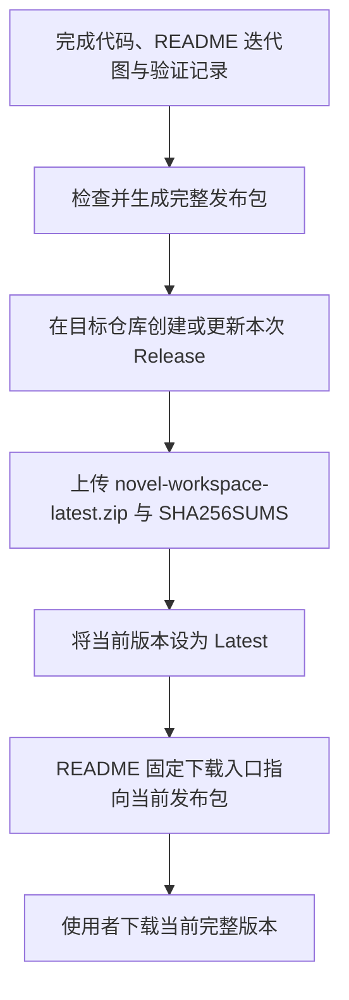

# GitHub 发布步骤

仅使用当前版本独立源码 ZIP。ZIP 不含 Git 历史、提交姓名/邮箱、浏览器数据或作者备份。不要上传上级目录、旧发布包或自己的导出文件。

## GitHub 上如何让新版接替旧下载入口

本项目采用“新版 Release + 固定文件名”的发布方式：发布当前版本，上传 `novel-workspace-latest.zip` 与 `SHA256SUMS`，将该 Release 设为 Latest。README 面向使用者始终指向最新 Release 的同名资源。旧版本可以保留用于追溯，无需要求用户修改本机文件来完成 GitHub 发布。

目标仓库：[fv6zp84ngy-hue/novel-workspace](https://github.com/fv6zp84ngy-hue/novel-workspace)。当前版本为 0.4.1；对外状态以仓库的 [Latest Release](https://github.com/fv6zp84ngy-hue/novel-workspace/releases/latest) 为准。README 中的固定下载地址已经指向此仓库，发布后应检查资源可下载且校验值一致。



当前固定下载地址为 [最新版完整使用包](https://github.com/fv6zp84ngy-hue/novel-workspace/releases/latest/download/novel-workspace-latest.zip)。以后发布版本仍使用同名资源，并将新版本设为 Latest。见 [GitHub 官方下载链接说明](https://docs.github.com/en/repositories/releasing-projects-on-github/linking-to-releases)。

发布时同步更新仓库根目录 README，确保流程图、当前版本、测试结果和 Release 内容对应。若目标 0.4.1 Release 已存在，先确认它是否允许编辑：可编辑时替换同名资源并同步校验文件；不可变发布应创建新版本，不能宣称已覆盖成功。没有明确要求时不删除历史 Release。

## 本地检查

```sh
python3 -B scripts/check.py
python3 -B scripts/build_release.py
```

输出为固定文件名 `dist/novel-workspace-latest.zip`（完整使用包，资源名跨版本保持一致）、版本归档 `dist/novel-workspace-0.4.1.zip`、同名目录与 `SHA256SUMS`。两个包都是完整程序；GitHub Release 对使用者优先提供 latest 包。固定清单见 `release-manifest.json`。在干净解压目录重复检查与启动，运行浏览器验收。

## 源码目录与历史

将当前版本公开文件更新到仓库根目录，不要把 `novel-workspace-版本号` 文件夹作为第二份工程嵌入根目录。Git 历史记录旧源码，Release 保存可下载版本。根目录 README、VERSION、源码和当前 Release 应相互对应。

## 首次建立独立 Git（已有仓库跳过）

在解压后的独立目录创建仓库，使用你打算公开的 Git 名称和邮箱；不继承其他工程的 Git 历史。可使用自己 GitHub 账号提供的 noreply 邮箱，不要编造他人身份。

```sh
git init -b main
git add -- .
git commit -m "Release Novel Workspace 0.4.1"
```

只有这个经核对的新目录适合 `git add .`。先用 `git log -1 --format=fuller` 检查提交元数据，再连接你的真实远程仓库地址并推送。

## 静态网页

保留根目录 index.html 和 .nojekyll，可按 [GitHub Pages 官方文档](https://docs.github.com/en/pages/getting-started-with-github-pages/creating-a-github-pages-site)从源码分支的根目录发布。正式发布后验证 Actions 与两条开始路径；当前没有预设线上网址或远程成功声明。

不同路径的 GitHub Pages 项目可能共用同一 origin；隐私稿件应放在单独受信任的 origin。地址变化前先备份。发布源码不代表上传浏览器稿件，但托管方仍会处理网页访问请求。

0.4.1 的模型和 WebDAV 功能需要运行本机 Python 网关。GitHub Pages 只托管基础界面；不要公开监听网关或放入任何默认 key。首次使用事件只在本地浏览器保存，测试导出 JSON 由操作者自行保管。真实作者、账号和设备验收未通过前，请将发布说明标为个人试用版本。

0.4.1 的浏览器协作模块已随发布包附带；从源码重新构建需 Node、`npm ci`、`npm run build:crdt`。发布包无需安装依赖。第三方许可见 `THIRD_PARTY_LICENSES.md`。
